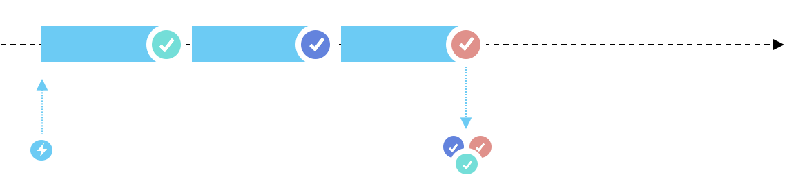
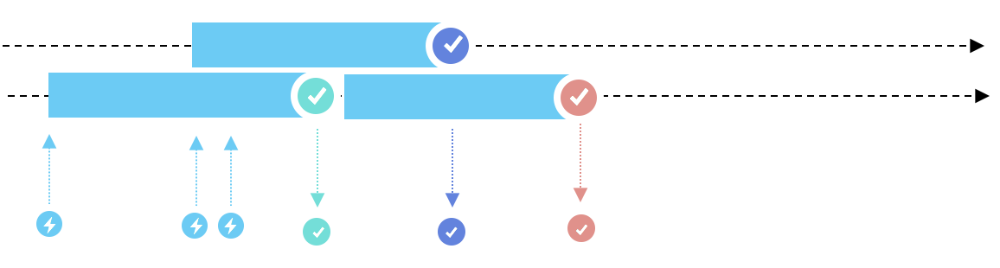
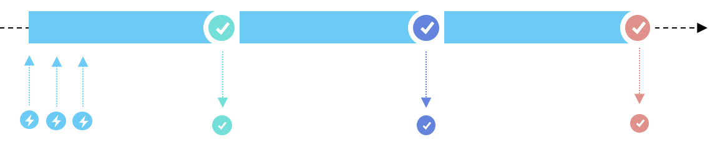
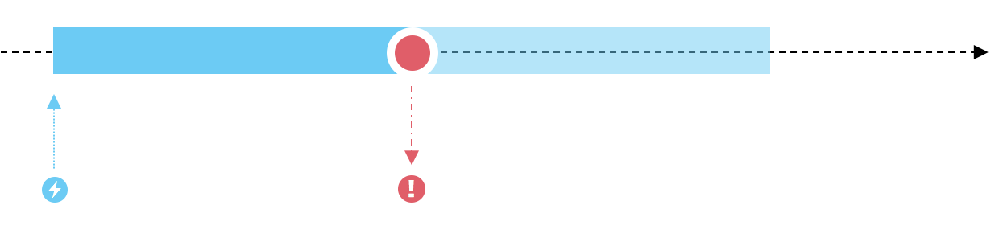
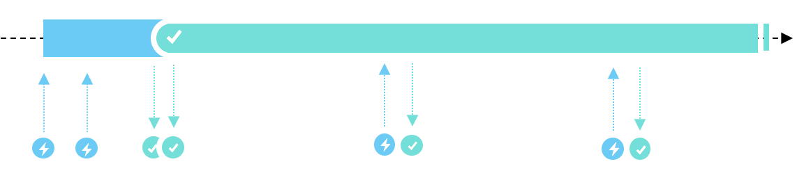
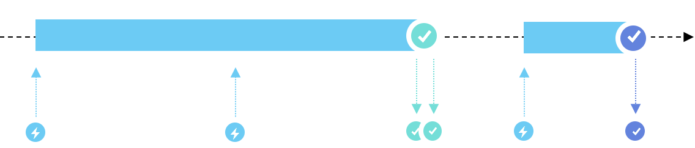
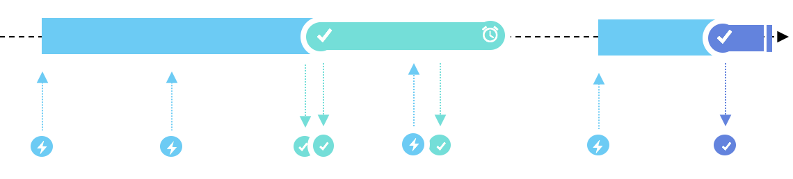
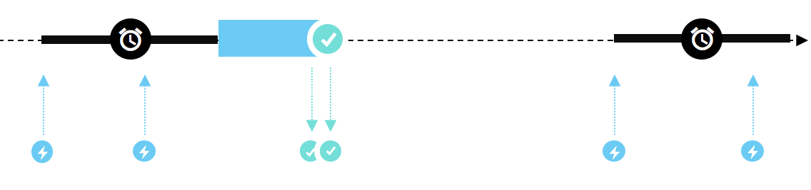

# Orkester

Lightweight framework for common centralized synchronization scenarios.

## Install

**Support**

Orkester supports  **.netstandard 1.1** and **PCL - Profile111**

|Platform|Version|
| ------------------- | :------------------: |
|.NET Framework|4.5|
|Windows Store|8+|
|Windows Phone|8+|
|Xamarin.Android|All|
|Xamarin.iOS|All|
|Xamarin.Mac|All|
|Xamarin.TVOS |All|
|Xamarin.WatchOS |All|

Available on NuGet

[](https://www.nuget.org/packages/Orkester/)

```shell
PM> Install-Package Orkester
```

## Scheduler

The Scheduler is a centralized place to request asynchronous operations from strings.

Abstraction of a request is represented easily and some behaviors can be added to registered asynchronous operations.

### Operations

An operation is nothing more than a `Task` factory for the Scheduler.

#### Creation

To instanciate operations, the easier way is `Scheduler.Create`.

##### Without result

```csharp
var operation = Scheduler.Default.Create(async (query, ct) => 
{ 
	await Task.Delay(10);
});
```

##### With result

```csharp
var operation = Scheduler.Default.Create<int>(async (query, ct) => 
{ 
	await Task.Delay(10);
	return 5;
});
```

#### Behaviors

Special behavior can be applied to operations to create new ones.

##### WithRepeat



Repeats sequentially an asynchronous functiun a number of times.


```csharp
var op = Scheduler.Default.Create<int>(async (query,ct) => 
{
	await Task.Delay(100);
	return 21;
}).WithRepeat(3); 

//->  [ 21, 21, 21 ]
```

##### WithMaxConcurrent



Executes the function with a maximum of concurent tasks at a given time.

```csharp
var op = Scheduler.Default.Create(async (query,ct) => 
{
	// ...
}).WithMaxConcurrent(2);
```

##### WithLock



Executes the function with a maximum of one concurent task at a given time.

```csharp
var op = Scheduler.Default.Create(async (query,ct) => 
{
	// ...
}).WithLock();
```

##### WithTimeout



Adds a timeout to a function execution : an exception is thrown in this case.

```csharp
var op = Scheduler.Default.Create(async (query,ct) => 
{
	// ...
}).WithTimeout(Task.Delay(50));
```

##### WithUniqueness



Executes the function only one time and caches its task for later execution requests.

```csharp
var op = Scheduler.Default.Create(async (query,ct) => 
{
	// ...
}).WithUniqueness();
```

##### WithCurrent



Returns the current task in one is beeing already executed.

```csharp
var op = Scheduler.Default.Create(async (query,ct) => 
{
	// ...
}.WithCurrent();
```

### WithExpiration



Returns the result of the last execution until it expires.

```csharp
var op = Scheduler.Default.Create(async (query,ct) => 
{
	// ...
}).WithExpiration(100); 

```

##### WithAggregation



Wait a period before starting the task, and aggregate all requested execution during this one to return only one task.

```csharp
var op = Scheduler.Default.Create(async (query,ct) => 
{
	// ...
}).WithAggregation(100);
```

### Registration

#### Operation

All operations must be registred into the Scheduler prior to invokation. To achieve this, operation's `Save` method can be used.

```csharp
Scheduler.Default.Create<int>(async (query, ct) => 
{ 
	await Task.Delay(10);
	return 5;
}).WithUniqueness().Save("/name");
```

### Groups and chains

As soon as you get you operations registered, groups and chain can be registered.

#### Groups

A group is an operation that executes a set of other registered operations concurently.

```csharp
Scheduler.Default.Group("/op1","/op2").Save("/group");
```

#### Chain

A group is an operation that executes a set of other registered operations sequencially.

```csharp
Scheduler.Default.Chain("/op1","/op2").Save("/chain");
```

### Invocation

Every registered operation can be executed from a string request containing the name/path of the operation by invoking `ExecuteAsync` method from scheduler.

#### `Task`

```csharp
await Scheduler.Default.ExecuteAsync("/void");
```

#### `Task<T>`

```csharp
var result = await Scheduler.Default.ExecuteAsync<int>("/withresult");
```

### Queries

#### Send parameters

To pass parameters to your operation, just append a common query string to your execution query.

```csharp
var result = await Scheduler.Default.ExecuteAsync<string>("/withresult?p1=example&p2=other&p3=7&p4=true");
```

#### Parameter access

Query parameters are available through properties of a `dynamic` object. The parsing is made by casting a property to one of supported types : `int`, `long`, `string`, `DateTime`, `float`, `double`, `bool`.

```csharp
Scheduler.Default.Create<string>(async (query, ct) => 
{ 
	var p1 = (string)query.p1;
	var p2 = (string)query.p2;
	var p3 = (int)query.p3;
	var p4 = (bool)query.p4;
	return $"{p1} {p2} {p3} {p4}";
}).WithUniqueness().Save("/withresult");
```

#### Signature

Query parameters values are part of operation signature : the async modifiers are independant for each set of query parameters (`?a=1&b=2` != `?a=2&b=1`, but `?a=1&b=2` == `?b=2&a=1`).

```csharp
var count = 0;

Scheduler.Default.Create(async (query, ct) => 
{ 
	await Task.Delay(10);
	count+= (int)p1 + (int)p2;
}).WithUniqueness().Save("/add");

await Scheduler.Default.ExecuteAsync("/add?p1=2&p2=1"); // + 2 + 1
await Scheduler.Default.ExecuteAsync("/add?p2=1&p1=2"); // Identical (not executed) even if unordered

await Scheduler.Default.ExecuteAsync("/add?p1=1&p2=2"); // + 1 + 2 
await Scheduler.Default.ExecuteAsync("/add?p1=1&p2=2"); // Identical

Assert.AreEqual(6,count);

```

### Services

If you have multiple operations you would like to register, you can simplify your code by declaring a service. A service is basically a class that declares asynchronous methods with special attributes for paths, params and behaviors.

```csharp
[Scheduled("/example")]
public class ExampleService
{
	public int Count { get; set; }
	
	[Scheduled("/add")]
	[WithUniqueness]
	public async Task<int> Add(int a, int b, CancellationToken token)
	{
		await Task.Delay(100,token);
		Count += a + b;
		return Count;
	}
}
```

You can then register all its operations to your scheduler.

```csharp
var service = new ExampleService();
Scheduler.Default.Register(() => service);
```

And now you're able to execute operations by querying the scheduler.

```csharp
var count = await Scheduler.Default.ExecuteAsync<int>("/example/add?a=1&b=2");
```

## Asynchronous extensions

The heart of Orkester are its set of very fluent basic extension functions for asynchronous functions. Very complex synchronization scenarios are implemented gracefuly as simple functions thanks to lambda compiled generated classes. So, each one of operation behaviors can also be invoked from simple `Func`.

```csharp
Func<CancellationToken, Task<int>> func = async (ct) => 
{
	await Task.Delay(100);
	return 21;
};

var re = func.WithRepeat(2);

var results = await re(ct); // [ 21, 21 ]
```

## Roadmap / Ideas

* Add more extensions
* Add storage of operation results
* Improve tests

### Contributions

Contributions are welcome! If you find a bug please report it and if you want a feature please report it.

If you want to contribute code please file an issue and create a branch off of the current dev branch and file a pull request.

### License

MIT © [Aloïs Deniel](http://aloisdeniel.github.io)